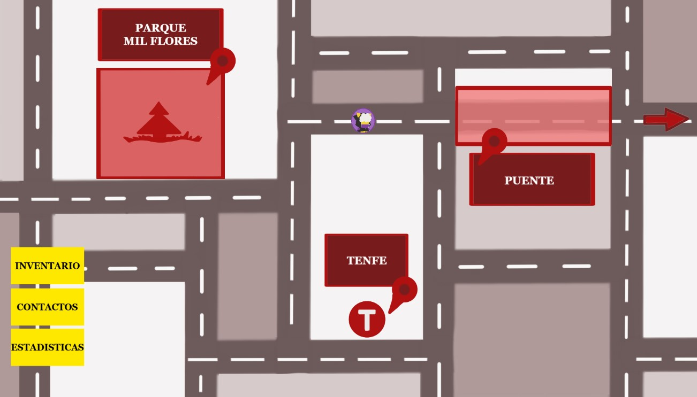

# Xhurro Games

**Hola, somos Xhurro Games**, un grupo de estudiantes universitarios de desarrollo de videojuegos, ¡y este es nuestro proyecto!

## Redes Sociales
[Linktree de Xhurro Games](https://linktr.ee/xhurrogames)

## Descripción del Proyecto

**Individuo 6** es un videojuego de exploración y combate por turnos en 2D. El jugador controla a **"Elle"**, un joven lleno de "esperanza", habitante de un **Madrizz** distópico y caótico. Para liberar la ciudad de las opresivas garras del líder corrupto y sus secuaces, Elle deberá enfrentarse a ellos en un feroz combate. Tras derrotarlos, conseguirá un trozo de constitución para acceder a la zona contaminada, lugar donde se esconde **Yusoa**, con el fin de conseguir restaurar la libertad e igualdad del pueblo madrizzleño.

El jugador deberá explorar las cuatro zonas de la metrópolis, en las que podrá interactuar con diversos vecinos, adquiriendo nuevos objetos y mejorando sus habilidades. Sin embargo, Elle sufre de ansiedad (afectando negativamente en combate si alcanza valores muy altos), por lo que tendrá que elegir sabiamente con qué individuos hablar.

Con un tono satírico, el juego está cargado de crítica social en contra de las grandes personalidades que generan odio hacia minorías reprimidas, posicionándose a favor de la libertad y derechos del individuo.

## Página Web
[Página Web de Xhurro Games](https://thatcreep2089.github.io/XhurroGames/)

## Imágenes del Juego
  
  
  
  
  
