# "YUSOA ES LEY"

## 1. Nombre de los autores
- Nerea Espinosa Calatayud
- Alicia Pérez Bumanlag
- Víctor Valenzuela Martínez
- Andrea González Anastasio

## 2. Ficha técnica
- **Título**: YUSOA ES LEY
- **Género**: Exploración, combate por turnos, comedia
- **Target**: Adulto joven entusiasta del humor negro y crítica social
- **Rating**: +16
- **Plataforma**:  Navegador Web
- **Modos de juego**: Single player

### Cartas:
- **Mecánica**: The Legend of Zelda: Breath of the Wild (m36) - Víctor
- **Personaje**: Ellie (p16) - Nerea
- **Ambientación**: Metrópolis conflictiva (a05) - Alicia
- **Libre**: Ansiedad (p07) - Andrea
- **Etérea**: Emociones reprimidas (e01): el grupo 06 utilizará la carta Ansiedad (p07)
- **Imposición grupo 09**: Red de relaciones (carta Persona 3): usamos la carta Gato en una caja (p13)
- **Slot extra 1**: Españita (a14)

## 3. Descripción
"Yusoa es ley" es un videojuego de exploración y combate por turnos en 2D. El jugador controla a **“Elle”**, un joven lleno de **“esperanza”**, habitante de un **Madrizz** distópico y caótico. Para liberar la ciudad de las opresivas garras del líder corrupto y sus secuaces, **“Elle”** deberá enfrentarse a ellos en un feroz combate. Tras derrotarlos, conseguirá un trozo de constitución para acceder a la zona contaminada, lugar donde se esconde **Yusoa**, con el fin de conseguir restaurar la libertad e igualdad del pueblo madrizzleño.

El jugador deberá explorar las cuatro zonas de la metrópolis, en las que hablará con sus diferentes vecinos, adquiriendo así nuevos objetos y mejorando sus habilidades.  
Sin embargo, **“Elle”** sufre de ansiedad (afectando negativamente en combate si alcanza valores muy altos), por lo que tendrá que elegir sabiamente con qué individuos hablar (Se explicará más adelante).

Con un tono satírico, el juego está cargado de crítica social en contra de las grandes personalidades que generan odio hacia minorías reprimidas, posicionándose a favor de la libertad y derechos del individuo.

## 4. Jugabilidad

### 4.1. Movimiento del personaje
- Movimiento **WASD** con diagonales en cámara top-down.
- Click para interacciones cuando nos encontremos en escenas de diálogos.
- Tecla “e” para interacciones cuando se mueve por la ciudad.

### 4.2. Cámara
Se utilizarán dos tipos de perspectiva:
- **Cámara ortogonal top-down** estática durante las zonas “google maps”.
- **Cámara frontal** estática para las zonas “específicas” y diálogo.

### 4.3. Mecánicas

#### EXPLORACIÓN
El jugador se moverá por las diferentes zonas de la ciudad para hablar con distintos npc’s, encontrar distintos objetos y descansar cuando sea necesario.  
**Objetos escondidos**: utilizados para recuperar vida y puntos de cualidad.  
**Diálogo de personajes**: al interactuar con los vecinos de cada zona, podrás mantener diálogos con ellos para tener la posibilidad de obtener mejoras en las habilidades.  
**Banco de piti**: puntos en el escenario donde podrás bajar la ansiedad y recuperar vida. Son de un solo uso.
**TENFE**: mapa de las líneas del tren, las cuales interconectan cada zona. Como en la vida real, el tren solo se puede coger en las estaciones locales de cada zona.

#### ANSIEDAD
El jugador sufre de ansiedad pudiendo incrementarse debido a distintas situaciones:
- **Diálogos con vecinos**: El nivel de ansiedad se incrementará al hablar con cualquier npc.
- **TENFE**: Al seleccionar la estación deseada para viajar,  incrementará el nivel de ansiedad dependiendo de cuanto tarde en llegar.

El nivel de ansiedad afectará a distintos campos de la jugabilidad:
- **Combate**: Al superar cierto umbral de ansiedad el daño se reducirá. 
- **Limitación de diálogos**: Al llegar al máximo de ansiedad el jugador no podrá hablar con ningún npc.

### COMBATE
El enfrentamiento será por turnos. El objetivo del jugador será derrotar al enemigo drenando toda la vida.

#### Ataque
El ataque estará representado con cartas. El jugador contará con un mazo establecido, el cual no podrá elegir. Las cartas están basadas en la baraja española. Las cartas están numeradas del 1 al 10, siendo ese el daño base que tiene la carta. Los palos serán los siguientes:
- **Oros** → Calderilla
- **Espadas** → Navajas
- **Bastos** → Porras
- **Copas** → Botellín

El jugador sacará 4 cartas del mazo aleatoriamente, creando así su mano. A la hora de atacar el jugador podrá hacerlo de dos maneras distintas:
1. **Con cualidades** consumiendo x puntos de cualidad (representados en el juego como maná). Estas cualidades afectan a los valores de las cartas.
2. **Sin cualidades**

Tras elegir alguna de estas opciones el jugador lanzará las 4 cartas en conjunto al enemigo, haciendo de daño la suma total. El enemigo atacará y nuevamente será el turno del jugador.

#### Estadísticas generales

**ESTADÍSTICAS JUGADOR**
- **Stats de cualidades**: son 4 relacionados con los palos de la baraja española. Estos poderes se mejoran explorando. Tendrán distintos efectos en las cartas de tu mano durante el combate:
  - Humildad
  - Trabajo duro
  - Agnosticismo
  - Afecto

**Puntos de maná**: Puntos a gastar para utilizar las cualidades. Se pueden recuperar con objetos.  
**Vida**: Puntos de salud del jugador. Se puede aumentar la vida máxima y recuperar puntos con objetos.  
**Ansiedad**: Puntos de ansiedad del jugador. Afecta negativamente al daño realizado.

#### Estadísticas enemigos
- **Debilidades**: Cada jefe de cada zona contará con una debilidad a cierto palo.
  Ejemplo:
  - Si el jefe es débil a la calderilla, Primero se sumará el daño base de todas las cartas de la mano que sean de calderillas con sus puntos por cualidades( en caso de haberse seleccionado) y se multiplicará ese daño por 2. Después ese resultado se añadirá a la suma de las otras cartas.  

## Tabla de Estadísticas de Enemigos

| **Jefes**           | **Debilidades** |
|---------------------|-----------------|
| **Jefe Oros**       | Porras          |
| **Jefe Espadas**    | Calderilla      |
| **Jefe Bastos**     | Botellín        |
| **Jefe Copas**      | Navajas         |

## 5. Diseño de niveles

“Yusoa es ley” cuenta con cuatro zonas distintas, cada una basada en los cuatro distintos palos de la baraja española, interconectadas con TENFE.

Cada zona cuenta con tres pantallas, las cuales, a su vez, cuentan cada una con dos a tres localizaciones con las que el jugador podrá interactuar, hablar con npc’s y encontrar objetos escondidos. Una será la zona del enemigo.

Para poder viajar entre las diferentes zonas el jugador deberá ir a cada estación y decidir viajar. El mapa de TENFE aparecerá y el jugador podrá elegir a cual de las cuatro estaciones quiere viajar.

En las pantallas (Google maps) el jugador podrá moverse por los caminos designados, pudiendo interactuar con distintas localizaciones.

En las localizaciones se encuentran los distintos Npc’s con los que el jugador puede hablar.

### 5.1. Imágenes de Mapa y pantallas

**ESQUEMA MAPA**
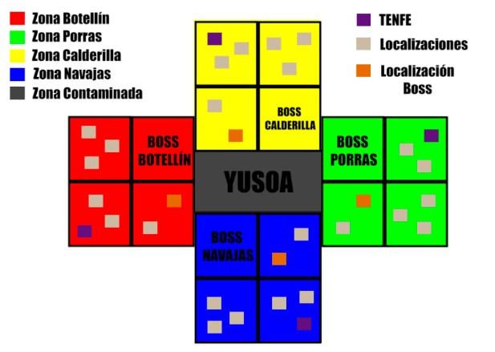

**BOCETOS PANTALLA DE JUEGO**:
- Pantalla combate  
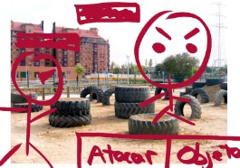

- Pantalla mapa TENFE  
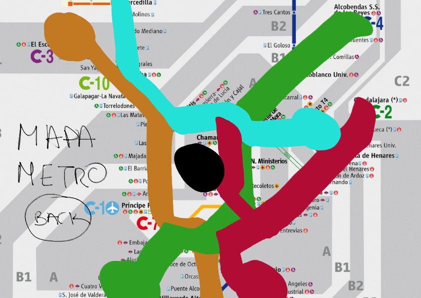

- Pantalla ejemplo zona  
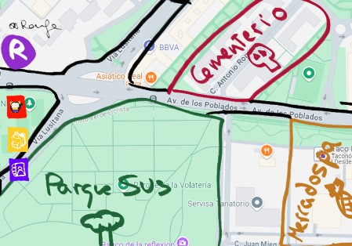

- Pantalla ejemplo sitio dentro de la zona  
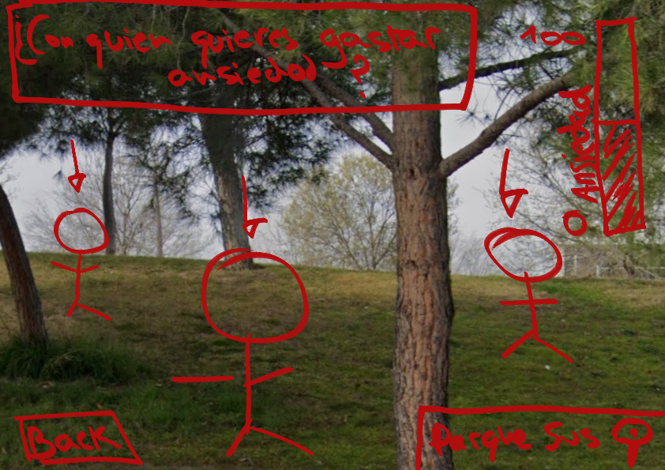

- Pantalla ejemplo dialogando  
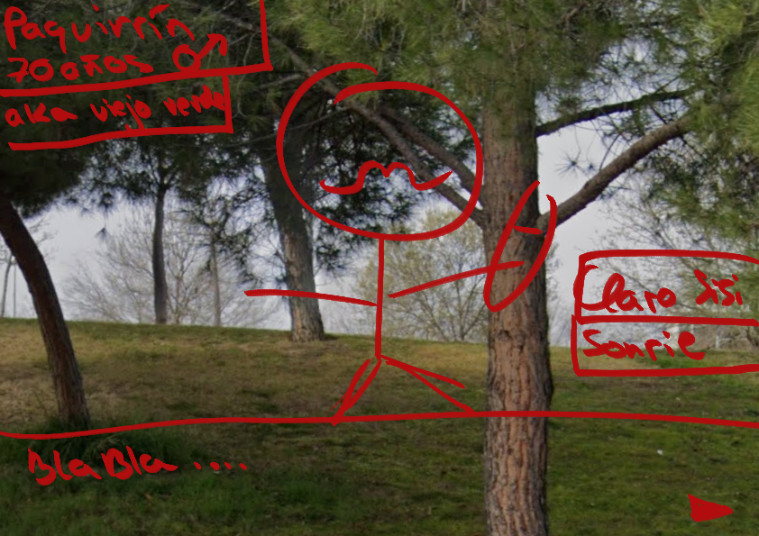

- Plantilla diseño de Npc’s  
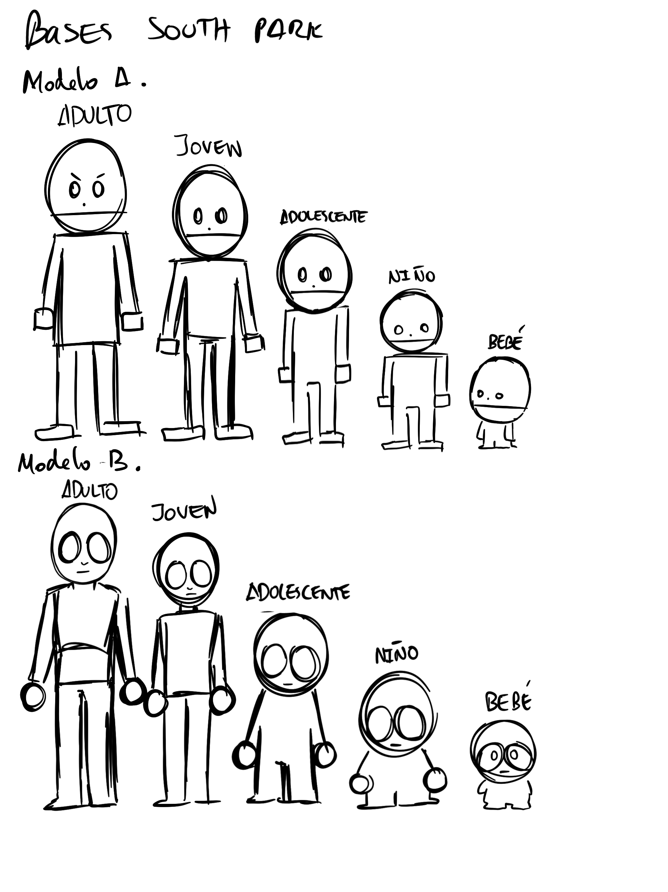

### 5.3. Descripción de partida típica
El jugador utilizará TENFE para ir a una zona de Madrizz. Allí podrá desplazarse por 3 pantallas, en cada una habrá lugares en los que podrá entrar. Dentro podrá interactuar con los npc, obteniendo mejoras y objetos, explorando la zona. Finalmente irá a combatir contra el enemigo de esa zona. Tras derrotarlo obtendrá un trozo de constitución. El juego continuará hasta que el jugador tenga los cuatro trozos y podrá desbloquear el acceso a la zona contaminada y enfrentarse al enemigo final.

## 6. HUD
## HUD - Estadísticas

| **NOMBRE**       | **DESCRIPCIÓN** |
|------------------|-----------------|
| **Estadísticas**        | Estadísticas de Elle (vida, puntos de cualidades, ansiedad, nivel de las cualidades)             |
| **Inventario**      | Objetos obtenidos (para aumentar vida/ptos cualidad máxima y regeneración de vida/ptos de cualidad)    |
| **Contactos**    | Información de los NPC tras conocerlos: Nombre, pronombre, imagen, y descripción breve     |

Todos los botones son de color morado.

### En pantalla

## 7. Visual
Cuenta con estética cartoon. La paleta de colores será diferente dependiendo de la zona.(Amarillo oros, azul espadas, verde bastos, rojo copas) 
La parte visual del juego bebe de la estética de juegos como South Park.
La paleta de colores dependerá del tipo de personaje.

## Colores de los Personajes

| **Personaje**       | **Colores**                                                                 |
|---------------------|-----------------------------------------------------------------------------|
| **Elle y Ellie**     | Paleta propia del personaje                                                  |
| **Yusoa**            | "Aberración cromática": Mezcla de todos los colores del parchís              |
| **Bosses de Zonas**  | Basados en los colores del parchís clásico, cada boss tendrá el color de su zona |
| **NPCs**             | Colores apagados y grisáceos                                                 |
| **Nosotros**         | Miembros del equipo aparecerán como NPCs, con una mezcla de colores grisáceos y el color de su zona |

### 7.2. Referencias
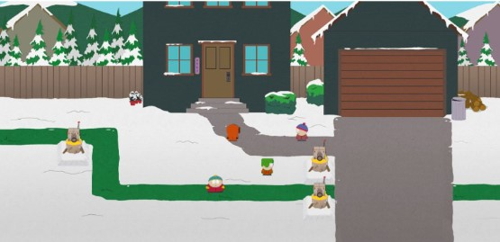  
(Referencia estética del juego anteriormente mencionado)

## 8. Menús
### MENÚ INICIO
- Iniciar partida.

### MENÚ TENFE
- El jugador podrá ir a cualquiera de las 4 estaciones.

### MENÚ DE ESTADÍSTICAS JUGADOR
- Muestra las estadísticas actuales del jugador: nivel de ansiedad, puntos de vida, puntos de cualidad y nivel de cualidades.

### MENÚ COLECCIÓN NPC’S
- Muestra todos los NPC’s disponibles, separados por la zona en la que estén. Para cada NPC se mostrará el nombre, una breve descripción y dónde se encuentra. Esto solo se verá una vez que el jugador haya hablado por primera vez con él.

### INVENTARIO
- Se mostrarán todos los objetos que tiene el jugador en el momento.

## 9. Contenido
### 9.1. Historia
Es el año 22V-4, Madrizz ha sido dividido en 4 grandes zonas. En un principio estas vivían en armonía y paz. Sin embargo, todo cambió cuando la malvada “Yusoa” se hizo con el poder central de la ciudad. Con una política opresiva y con la ayuda de sus cuatro secuaces más cercanos, las cuatro zonas se vieron sometidas. El ansia de poder y control fue tal que enemistó a las zonas, anteriormente pacíficas, e implantó un orden de corrupción y opresión en Madrizz.  

“Elle” se despierta tras un fuerte golpe que un policía le propinó tras una manifestación por los derechos. Extrañamente al despertar su ciudad ha cambiado. Ellie la líder de las luciérnagas(resistencia) le encuentra. Ellie le explica que está en el futuro y el estado de la ciudad. Elle se da cuenta de que los leves malestares sociales de su época habían empeorado, llevando a Madrizz a una situación extrema de conflicto y problemas.  

Así comienza la historia de “Elle” quien decide, con la ayuda de “Ellie”,  recuperar la libertad y los derechos, derrocando a “Yusoa” y sus malvados secuaces.  

Para lograr su objetivo, “Elle” deberá explorar las distintas zonas, hablar con sus vecinos y armarse de valor y poder para derrotar el secuaz que gobierna cada zona, obteniendo un trozo de la constitución. Será, sólo tras haber derrotado a los cuatro que “Elle” tendrá la posibilidad de intentar derrotar a “Yusoa”.  

Mientras “Elle” derrota a los enemigos, “Ellie” irá reclutando a más vecinos para integrarlos a la resistencia. Finalmente “Elle” derrota a “Yusoa” y el pueblo respalda la rebelión bajo el liderazgo de Ellie.  

### 9.2. Zonas
Cada zona está basada en uno de los palos de la baraja española, siendo iguales a los palos de las cartas de ataque.  
| **NOMBRE**       | **DESCRIPCIÓN**                                                              | **REFERENCIA REAL**          |
|------------------|------------------------------------------------------------------------------|------------------------------|
| Zona Calderilla  | Zona con tonos amarillentos, con lugares de alto nivel como una pista de golf | Moraleja / Madrid norte       |
| Zona Navajas     | Zona con tonos azulados, con lugares en malas condiciones                     | Leganés / Madrid sur         |
| Zona Porras      | Zona con tonos verdosos, con lugares de reparto de paquetes                   | Coslada / Madrid este        |
| Zona Botellín    | Zona con tonos rojizos, con lugares religiosos                                | Aravaca / Madrid Oeste       |

### 9.3. Personajes Principales
| **NOMBRE**          | **DESCRIPCIÓN**                                                                                          | **DISEÑO/IMAGEN** |
|---------------------|----------------------------------------------------------------------------------------------------------|-------------------|
| **Elle**            | Protagonista del juego. Aparece en Madrizz y decide derrocar al régimen corrupto.                        |                      |
| **Ellie**           | Personaje secundario. Introduce el mundo a “Elle” y lidera en las sombras la resistencia (Luciérnagas). Mientras que Elle se encuentra luchando con los secuaces en cada zona y contra Yusoa, Ellie va ganando adeptos a su causa para organizar un levantamiento popular contra el régimen. |                   |
| **Yusoa**           | Enemigo final. Fue quien dividió Madrizz en las 4 zonas y guarda el poder absoluto.                       |    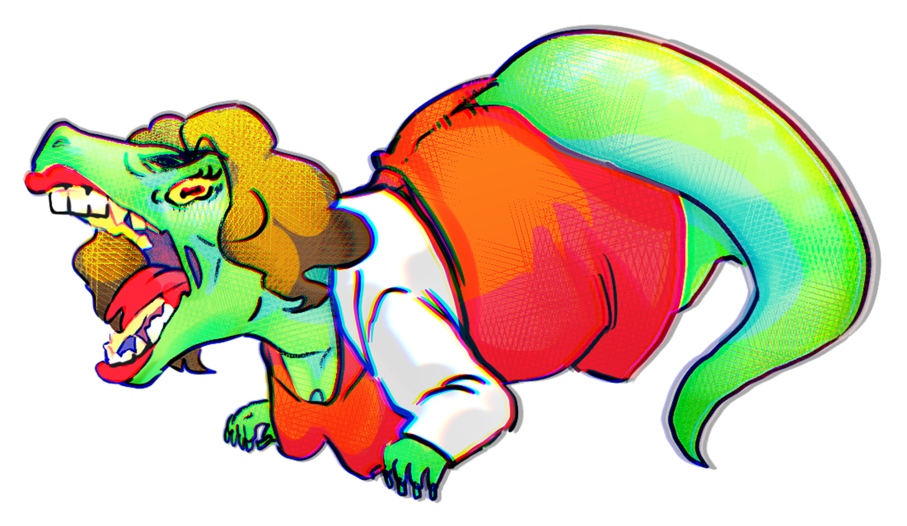                 |
| **Boss Oros** | Varin.Secuaz de Yusoa. Clasista.                                                                                 | 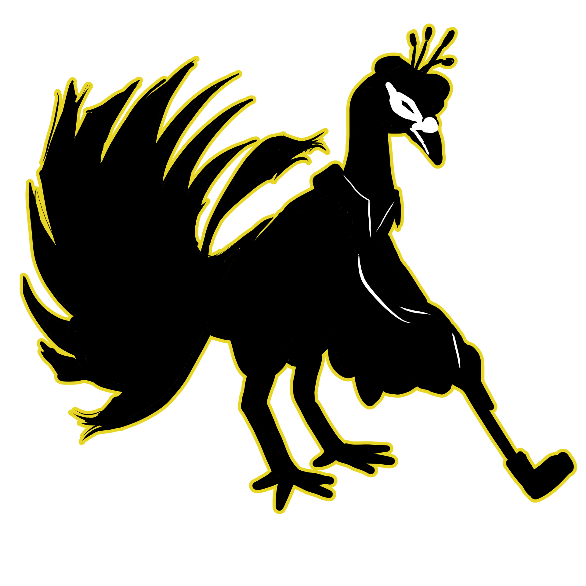                  |
| **Boss Espadas**    | Luthor.Secuaz de Yusoa. Sanguinario.                                                                              |                          |
| **Boss Bastos**     | Rajmur.Secuaz de Yusoa. Avaricioso.                                                                               | 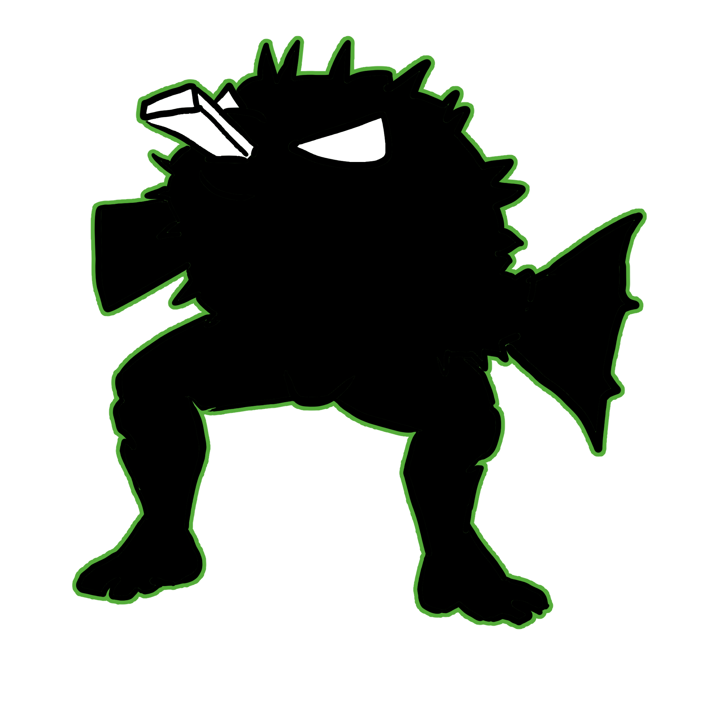                         |
| **Boss Copas**   | Kador.Secuaz de Yusoa. Egocéntrico.                                                                              |    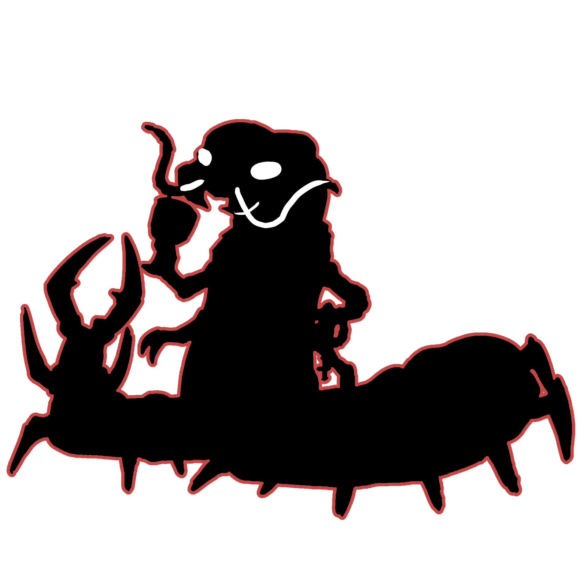               |

## 10. Referencias
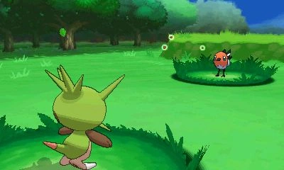
**Pokemon** (sistema de combate)  

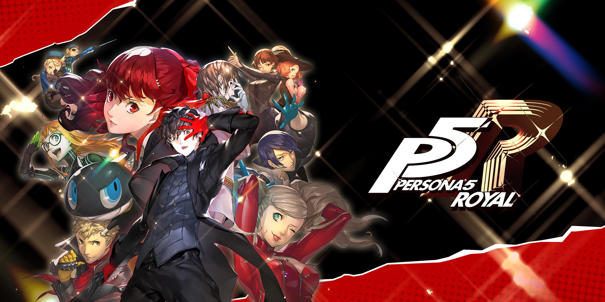
**Persona 5** (relaciones y crítica social)  

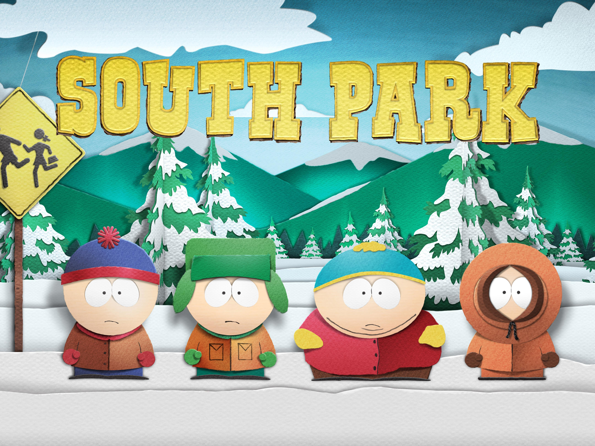
**South Park** (Estilo artístico)  

